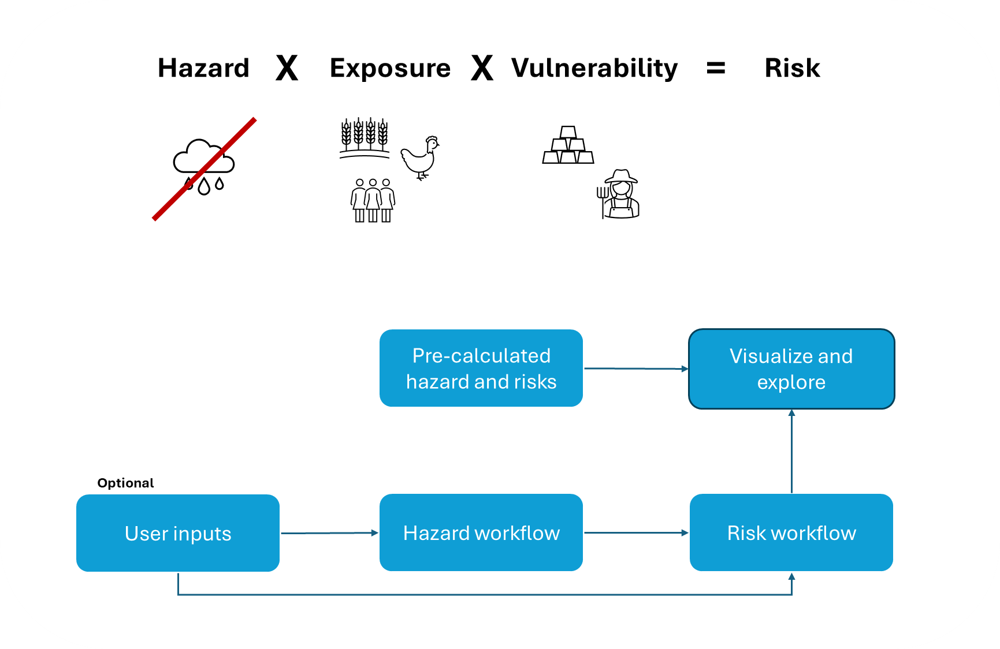
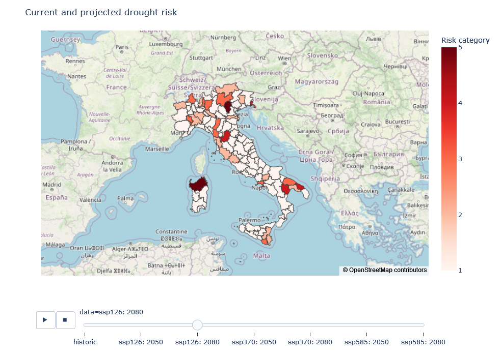

# Relative Drought risk workflow

## About droughts and droughts' risks

### What is a drought?

Simply stated, drought is ‘the extreme persistence of precipitation deficit over a specific region for a specific period of time’. Droughts are often classified into three main types differentiated by their severity, impacts, and time scales:

1. <ins>Meteorological drought</ins> is often caused by short-term precipitation deficiency and its impacts highly depend on its timing. For example, lack of rain during the sprouting phase in rainfed agriculture could lead to crop failure.
2. <ins>Agricultural drought</ins> is a medium-term phenomenon, characterized by reduced soil moisture content and is caused by a prolonged period of meterological drought.
3. On the long-term, <ins>hydrological drought</ins> is characterized by lower stream flow, reduced water level in water bodies, and may affect groundwater storage.

The cascade between drought types is goverened by the severity (i.e., magnitude), duration, and spatio-temporal distribution of drought events.

### How do we assess drought risk?

Drought risk is a measure for quantifying the likelihood of a meaningfull impact from drought-event(s) on human population, its economic activity and assets, and the environment. The risk for an impact depends on the <ins>drought hazard</ins>, <ins>exposure</ins>, and the <ins>vulnerability</ins> to droughts.

- <ins>Hazard</ins> measures the magnitude, duration, and timing of drought events.
- <ins>Exposure</ins> to droughts represents the spatial distribution of drought relative to the distribution of potentially impactful systems, e.g., location of cultivated land, wetlands, etc.
- <ins>Vulnerability</ins> stands for the level of impact expected for a given system during a given event, and is affected by the systems' intrinsic attributes. For example, fields with drought-resistent crop varities would be less vulnerable to droughts.

This workflow quantifies drought risk as the product of drought hazard, exposure and vulnerability. The methodology used here was developed and applied globally by [Carrão et al. (2016)](https://doi.org/10.1016/j.gloenvcha.2016.04.012). The result of this workflow is a risk map showing the relative drought risk at the NUTS3 level for a selected NUTS2 unit.

:::{admonition} How to use this workflow?
:class: note

The workflow contains pre-calculated results, which can be explored in the visualization workflow. Users input is optional and can be fed into the hazard workflow, risk workflow (e.g., exposure, and/or vulnerability), or both.

The drought hazard and risk workflow are applied at national scale and a NUTS3 resolution. Thus, user inputs should cover the all NUTS3 in a country.
:::

## What data does the workflow require?

### Hazard data and methods

Drought hazard for a given region is estimated as the probability of exceedance of the median of regional (e.g., EU level) severe precipitation deficits for a historical reference period (e.g., 1981-2015) or for a future projection period (e.g., 2031-2060; 2071-2100). 

For estimating drought hazard, this workflows requires monthly total precipitation for each NUTS3 region during the historical reference period or future projection period in a selected country.

Pre-processed data is available for the historic workflow as well as future projections. The ensemble average from ISIMIP 3b bias-adjusted atmospheric climate input data (https://doi.org/10.48364/ISIMIP.842396.1) is used for both historical period (1981-2015) and future projections (near-future (2050) 2031-2060 and far-future (2080) 2071-2100). Precipitation data is the average of five CMIP6 global climate models (GCMs; GFDL-ESM4, IPSL-CM6A-LR, MPI-ESM1-2-HR, MRI-ESM2-0, UKESM1-0-LL), for three SSP-RCPs combinations (SSP126, SSP370, SSP585) provided at a spatial resolution of 0.5°x0.5°.

Processing these data is performed by applying Geographic Information System (GIS) techniques, to extract an aggregated value (e.g., total precipitation) of the data points located within each area of interest (e.g., NUTS3 region). Zonal statistics is widely used for that purpose, and it was the method used in our data processing.

:::{important}
The expected data format is a table where each row represents the total precipitation in mm for a month/year combination, and each column represents an area of interest (e.g. NUTS3 region). The first column contains the date in this format YYYY-MM-DD. The **title of the first columns has to be 'timing' and the rest of the titles have to be the codes of the areas of interest (e.g. NUTS3), which have to be identical to the codes as they appear in the NUTS3 spatial data from the <a href = "https://ec.europa.eu/eurostat/en/web/nuts/background">European Commission</a>**.
:::

Tables with precipitation data were created for each dataset (historic and future projections) and saved as separate .csv files. Furthermore, for each of the selected SSP-RCPs combinations (SSP126, SSP370, SSP585) we created separate input files for the years 2031-2060 (near-future) and 2071-2100 (far-future). Users are advised to use the provided data to preserve the consistency between the historical and projected data. Alternatively, users that prefer to use their precipitation data should make sure the historical and projected data are consistent (e.g., outputs of a single model).

### Exposure data and methods

Drought exposure indicates the potential losses from different types of drought hazards in different geographical regions. In general, exposure data identifies and quantifies the different types of physical entities on the ground, including built assets, infrastructure, agricultural land, people, livestock, etc. that can be affected by drought (e.g. the number of cars does not count).

Quantifying drought exposure utilizes a non-compensatory model to account for the spatial distribution of a potential impact for crops and livestock, competition on water (e.g., for industrial uses represented by the water stress indicator), and human direct need (e.g., for drinking represented by population size).

:::{important}
The algorithm expects a table in which each row represents an area of interest, and each column a variable. The **first column contains the codes of the area of interest (e.g., NUTS3), which have to be identical to the codes as they appear in the NUTS3 spatial data from the <a href = "https://ec.europa.eu/eurostat/en/web/nuts/background">European Commission</a>**.
:::

In this workflow we used the following data (provided in the exposure sample file):

#### Data Inventory

| Data item | Period | Description | Format and processing | Source |
| :-: | :-: | :- | :- | :-: |
| Cropland | Historic | Harvested land represents the exposure of agricultural activity to droughts. SPAM is a global crop distribution model covering 42 crops and four different technologies available for 2010 (latest). The model outputs include both harvested and physical cropland. | 5 arc-minutes crop-specific grid. All grids are to be summed and aggregated (using Zonal Statistics) per area of interest. | https://mapspam.info/ |
| Cropland | Future | Cropland landcover under different Shared Socio Economic Pathways (SSPs) is a downscaled dataset of the integrated assessment model (IAM) GCAM. | The grid-cell area of a 30 arc-seconds land use grid, was summed for all cropland cells and aggregated (using Zonal Statistics) per area of interest. | [Zhang, Cheng, and Wu, 2023](https://www.nature.com/articles/s41597-023-02637-7#Sec1) |
| Livestock density | Historic | Livestock density represents the exposure of animal husbandry systems to droughts. The Gridded Livestock of the World maps (GLW) show the density of eight different livestock animals in 2010 and 2015. | 5 arc-minutes animal-specific grid. All grids are to be summed and aggregated (using Zonal Statistics) per area of interest. | https://www.fao.org/livestock-systems/global-distributions/en/ |
| Livestock density | Future | Not Available | Not Available | Not Available |
| Competition on water | Historic | The water stress indicator is a proxy for competition on water, as it accounts for both multi-sectoral water demand, relative to the abundance of water. Values higher than 0.4 indicate on severe water stress and a high competition on water resources. |  Aqueduct v.4 provides global water-stress estimates at sub-catchment scale.  We have rasterized the water stress and water withdrawal, and calculated a weighted average water stress per unit of interest. | https://www.wri.org/data/aqueduct-global-maps-40-data |
| Competition on water | Future | The water stress indicator is a proxy for competition on water, as it accounts for both multi-sectoral water demand, relative to the abundance of water. Values higher than 0.4 indicate on severe water stress and a high competition on water resources. |  Aqueduct v.4 provides global water-stress estimates at sub-catchment scale.  We have rasterized the water stress and water withdrawal, and calculated a weighted average water stress per unit of interest. | https://www.wri.org/data/aqueduct-global-maps-40-data |
| Human direct need | Historic | Population counts represent the basic drinking water requirements across regions. Considering a similar economic and social context, these counts can also indicate the toal doemtic water demand. Global gridded population products are available at high resolution and multiple years, yet for the scope of the EU, a data from EUROSTAT is readily available.| EUROSTAT data is available as tabular format for the NUTS3 regions.| https://ec.europa.eu/eurostat/ |
| Human direct need | Future | Population counts represent the basic drinking water requirements across regions. Considering a similar economic and social context, these counts can also indicate the total domestic water demand. Global gridded population products are available at high resolution and multiple years, and for this analysis - the rural and urban populations grid from Global CWatM were used.| Global CWatM provides rural and urban population grids at a spatial resolution of 5 arc-minutes. | - |

Data tables were created for each dataset (historic and future projections) and saved as separate .csv files. For each of the selected SSP-RCPs combinations (SSP126, SSP370, SSP585) we created separate input files for the years 2015-2050 (near-future) and 2050-2080 (far-future).

Depending on the region of interest, other indicators may also be relevant for estimating drought exposure. We recommend that users research the most relevant factors in the region that may be exposed to drought before starting the analysis.

### Vulnerability data and methods

Vulnerability data describes the elements that make a system susceptible to a natural hazard, which vary depending on the type of hazard and the nature of the system. However, there are some generic indicators such as poverty, health status, economic inequality and aspects of governance, which apply to all types of exposed parts and therefore remain constant despite changes in the type of hazard that pose a risk.

In this workflow, the selection of proxy indicators follows the criteria defined by Naumann et al. (2014): the indicator has to represent a quantitative or qualitative aspect of vulnerability factors to drought (generic or specific to some exposed element), and public data need to be available at the national scale, and at a subnational (NUTS3) resolution.

The vulnerability indicators are common proxies for economic, social, and infrastructural factors of drought vulnerability in each geographic location. We recommend that users research the most relevant factors in the region that make it vulnerable to drought before starting the analysis. As we currently only propose two vulnerability indicators, we do not divide the input data into different factors (e.g., economic, social, or infrastructure), rather we relate it to 'overall' vulnerability.

:::{important}
The algorithm expects a table in which each row represents an area of interest, and each column a variable. **If different factors of vulnerability are accounted for (e.g., social, economic, etc.), each variable has to be named with a prefix according to the factor, i.e. Social_ Economic_ or Infrast_, followed by a number or the name of the variable. The first column contains the codes of the area of interest (e.g., NUTS3), which have to be identical to the codes as they appear in the NUTS2 spatial data from the <a href = "https://ec.europa.eu/eurostat/en/web/nuts/background">European Commission</a>**.
:::

Also for vulnerability, we created separate .csv tables for each dataset (historic and future projections) and for the years 2015-2050 (near-future) and 2050-2080 (far-future) under each SSP-RCPs combination.

In this workflow we used the following data (provided in the vulnerability sample file):

#### Data Inventory

| Factor | Data item | Period | Description | Format and processing | Correlation with Vulnerability | Source |
| :-: | :-: | :-: | :- | :- | :-: | :-: |
| Overall | GDP per capita (current US dollar) | Historic | Gross domestic product (GDP) is a monetary measure of the market value of all the final goods and services produced in a specific time period by a country or countries. | Data is available as global grids at a 30 arc-secondes resolution from Global CWatM. The GDP per capita was calculated by dividing the  GDP by the total population counts, for each NUTS3 unit. | negative | - |
| Overall | GDP per capita (current US dollar) | Future | Future Gross domestic product (GDP) is a monetary measure of the market value of all the final goods and services produced in a specific time period by a country or countries. | Data is available as global grids at a 30 arc-secondes resolution. | negative | [Wang and Fubao, 2022](https://zenodo.org/records/5880037) |
| Overall | Rural population | Historic | Percentage of total population in a country or region that lives in rural areas. | Data is available as global grids at a 30 arc-secondes resolution from Global CWatM. The share of rural population was calculated by dividing the rural by the total population counts.| positive | - |
| Overall | Rural population | Future | Percentage of total population in a country or region that lives in rural areas. | Data is available as global grids at a 30 arc-secondes resolution from Global CWatM. The share of rural population was calculated by dividing the rural by the total population counts. | positive | - |

:::{admonition} Is including multiple vulnerability factors possible?
:class: hint

Vulnerability to drought is computed as a 2-step composite model that derives from the aggregation of proxy indicators representing different factors like: economic, social, and infrastructural.

In the first step, indicators for each factor (i.e. economic, social and infrastructural) are combined using data envelopment analysis (DEA). In the second step, individual factors resulting from independent DEA analyses are arithmetically aggregated (using the simple mean) into a composite model of drought vulnerability (dV):

$$dv_i = \frac{\sum{factor_{i,j}}}{n}$$

where $factor_{i,j}$ represents the vulnerability scores for the selected factor $j$ and region $i$ (e.g, social, and economic), and $n$ is the number of selected factors.
:::

:::{admonition} Are there examples for vulnerability indicators?
:class: hint

- **Economic indicators** may include energy use per person (negatively correlated with vulnerability; -), Agriculture value added on the GDP (+), and GDP per capita (-).
- **Social indicators** may include the share of rural population (+), share of people with access to safely managed drinking water (-), life expectancy at birth (+), share of population at working age (-), management of water related disasters (-), and government effectiveness (+).
- **Infrastructure indicators** may include percentage of irrigated land (-), and road density (-).
:::

## Outputs

This workflow allows to generate maps and linecharts that will help users to address the following questions:

- How will the absolute drought hazard for the NUTS3 regions of the selected country change in the future?

Example of absolute drought hazard comparison (in terms of WASP values) between NUTS3 level for historic and future scenarios in a focal (NUTS2) area.

- What is the relative drought risk in each NUTS3 region of the selected country within a given historical period?
- How will the relative drought risk between NUTS3 regions change in the future?

Example of a map showing the relative drought risk in each NUTS3 region of a selected country. Please note that the risk category for each region is always relative to the other regions considered in the workflow (here: country level) and therefore not directly comparable between datasets. This means that the risk category of one region may be higher or lower compared to the other regions, but not between e.g. historical vs. future datasets. Please refer to the risk assessment workflow for more details on how drought risk is calculated.

Instructions on how to generate these outputs are available in the risk visualization workflow.

## Limitations

For calculating the drought hazard under future scenarios, we used an average of 5 different CMIP6 global climate models (GFDL-ESM4, IPSL-CM6A-LR, MPI-ESM1-2-HR, MRI-ESM2-0, UKESM1-0-LL) for each of the three SSP-RCPs combinations (SSP126, SSP370, SSP585). Although this is a common approach, it is recommended that users run the workflow using data from different models to test for model uncertainty.

Results on risk category for each region are always relative to the other regions considered in the workflow (here: country level) and therefore should not be considered as absolute risk level. This means that a region showing a higher projected risk score relative to the historical baseline, does not necessarily experience higher drought risk, rather it is more at risk relative to other areas in its country. However, regions' drought hazard metrics are absolute and comparable among datasets, and can thus help users to understand if changes on relative drough risk of NUTS3 regions are accompanied by an increasing drought hazard. Changes in exposure and vulnerability  also affect drought risk, and users are encouraged to carefully select exposure and vulnerability indicators, adapting them to their regional context and data availability.

Finally, this workflow needs to be run at the country level (NUTS2) for comparing among NUTS3 level in order to maintain model stability. This means that if users want to provide their own data, they need to provide national data.